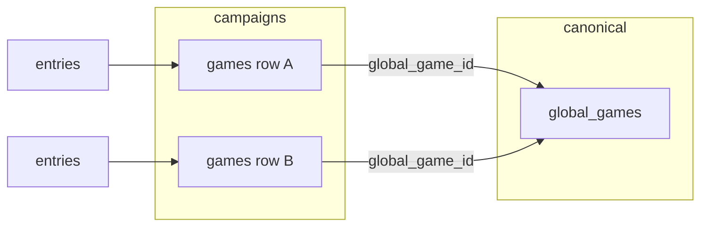

# Consolidate games list

## Current state

- **Data model**: [supabase/migrations/001_initial_schema.sql](supabase/migrations/001_initial_schema.sql) — `games` has `playgroup_id` and optional `global_game_id` (FK to `global_games`). [sql/admin_tables.sql](sql/admin_tables.sql) defines `global_games` (BGG-sourced). Entries reference `games(id)`.
- **Where duplicates show up**: The **admin** Games table ([js/admin-page.js](js/admin-page.js) `renderGamesTable`) lists every `games` row, so the same logical game (e.g. "Catan") appears once per campaign. The main app loads one campaign at a time ([js/supabase.js](js/supabase.js) `fetchGames(playgroup_id)`), so its list is already per-campaign.
- **Existing consolidation hook**: BGG linking in admin and in the main "Add Game" flow ([js/events.js](js/events.js)) already set `global_game_id` when a game is linked. Linked games share a canonical identity across campaigns.

## Recommended approach

Use `**global_game_id`** as the consolidation key and add (1) a consolidated view for admins, (2) within-campaign merge, and (3) optional name-based grouping for unlinked games.

- **Linked games**: Multiple `games` rows (different campaigns) with the same `global_game_id` = one canonical game. Any list or report can group by `global_game_id` to show a single consolidated row.
- **Unlinked games**: No shared identity today; consolidation can group by normalized name (see below) for display only, and encourage linking or merging.

---

## Pre-implementation safeguards

These changes should be applied to avoid clashes and errors:

1. **Optional chaining in admin lookups** — In [js/admin-page.js](js/admin-page.js), anywhere `game` is used after `_games.find(g => g.id === e.game_id)` (e.g. Overview `renderTopGames`, entries table, etc.), add `game?.` guards or `if (!game) return` so stale or orphaned `e.game_id` does not throw. Example: `game?.global_game_id || game?.name || '—'`.
2. **Merge DB order** — `entries.game_id` has `ON DELETE CASCADE`. If the source game is deleted first, its entries are cascade-deleted instead of reassigned. The merge function MUST: (a) update entries, (b) optionally copy `game_metadata`, (c) then delete source game.
3. **Admin state after merge** — After a successful merge, update in-memory state: for each `_entries` row where `e.game_id === sourceId`, set `e.game_id = targetId`; remove the source game from `_games`. This keeps admin UI consistent without refetching.

---

### 1. Admin: "Consolidated games" view

Add a new **subtab** under "Games & Players" (alongside Games and Players) so it shares the same loader (`loadGamesPlayers`) and data (`_games`, `_entries`, `_globalGames`, `_playgroups`).

- **Grouping**:
  - **Linked**: Group by `global_game_id`. Display canonical name from `global_games`, list of campaigns (playgroup names), total wins (sum of entries across all linked game rows).
  - **Unlinked**: Group by normalized name (e.g. lowercase, trim, strip parentheticals like "(4th Ed)") so "Catan", "Catan (4th)", "CATAN" appear as one group; show campaigns and total wins.
- **Columns (example)**: Canonical name | Campaigns | Total wins | # game rows | Actions (Link to BGG, Merge for same-campaign groups).
- **Data**: Reuse `_games`, `_entries`, `_globalGames`, `_playgroups`; compute groups in JS. No new API. Ensure `loadGamesPlayers` (and thus Overview) has run so `_globalGames` is loaded.

Files to touch: [admin.html](admin.html) (add subtab button and panel), [js/admin-page.js](js/admin-page.js) (render function for consolidated view).

---

### 2. Within-campaign merge (same playgroup)

Allow merging two game rows **in the same campaign** so that all entries and metadata point to one game and the other is removed. Use case: "Catan" and "Catan (4th)" were both added in Campaign A; merge into one.

**API**: New `adminMergeGames(sourceGameId, targetGameId)` in [js/supabase.js](js/supabase.js) (admin client). Implementation order:

1. Fetch both games; verify same `playgroup_id`; throw if not.
2. Update `entries` SET `game_id = targetId` WHERE `game_id = sourceId`.
3. If target has no `game_metadata` image and source does, upsert target's `game_metadata` with source's image (before delete).
4. Delete source game (cascade deletes source's `game_metadata`).

**Admin state updates** (in [js/admin-page.js](js/admin-page.js) after successful merge):

- For each `e` in `_entries` where `e.game_id === sourceId`, set `e.game_id = targetId`.
- Remove source from `_games`: `_games = _games.filter(g => g.id !== sourceId)`.
- Re-render Games table and Consolidated view.

**UI**: Add "Merge" action in Games table and/or Consolidated view. User picks source (to remove) and target (to keep); confirm; call API; update state.

Schema: no change. Admin client bypasses RLS.

---

### 3. Optional: Link multiple unlinked games to one global game

When consolidating unlinked games by normalized name, allow "Link all to same BGG": after linking one game in the group to a BGG result, offer to link the other games in the same group to that same `global_game_id`. This reduces repeated BGG search for the same title across campaigns.

- Implementation: In the consolidated view, for an unlinked group, add "Link to BGG" that opens existing BGG search; on success, optionally prompt "Link other games in this group?" and call `linkGameToGlobal(gameId, globalGameId)` for each.

---

### 4. Main app (optional)

The main app currently shows games for **one campaign only**. No changes in this plan. Cross-campaign unified list can be a follow-up.

---

## Impact summary

| Area              | Impact                                                                                                          |
| ----------------- | --------------------------------------------------------------------------------------------------------------- |
| Main app          | None. Uses `game` (name) from joined fetch; merge reassigns entries to target game, so names resolve correctly. |
| Admin state       | Must update `_entries` and `_games` in place after merge.                                                       |
| Admin lookups     | Add `game?.` guards where `game` may be undefined.                                                              |
| Merge API         | Strict order: update entries → copy metadata if needed → delete source.                                         |
| Consolidated view | New subtab under Games & Players; read-only aggregation from existing data.                                     |

---

## Summary

| Item                                | Purpose                                                                                              |
| ----------------------------------- | ---------------------------------------------------------------------------------------------------- |
| **Consolidated games view (admin)** | One row per canonical game (by `global_game_id` or normalized name); shows campaigns and total wins. |
| **Within-campaign merge**           | Merge two game rows in same playgroup (reassign entries, copy metadata, delete source).              |
| **Link all in group**               | Optionally link all games in same normalized-name group to one BGG entry.                            |
| **Pre-implementation fixes**        | Optional chaining in admin; correct merge order; admin state updates after merge.                    |

No database migration required. New code: admin UI (subtab + render), `adminMergeGames` in supabase.js, optional chaining in existing admin lookups.