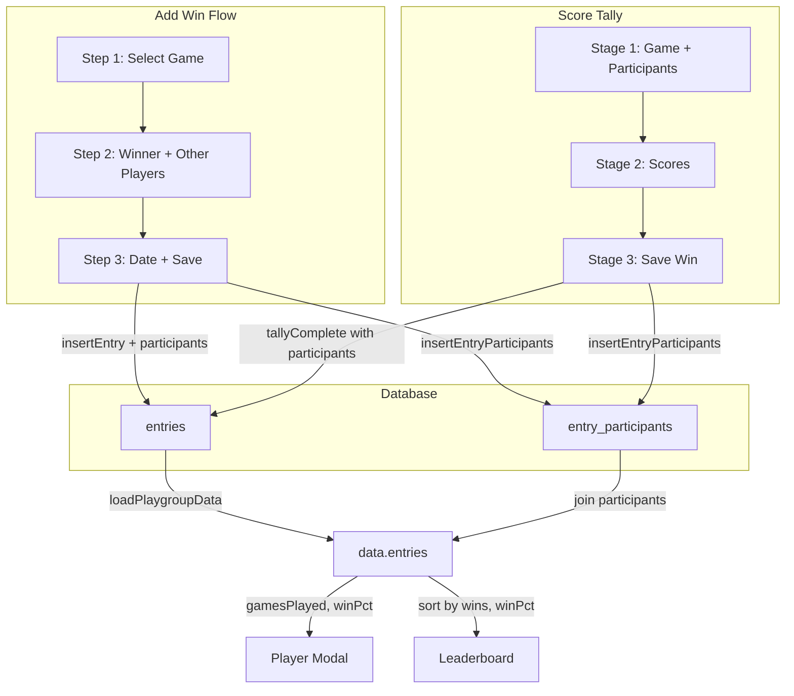

# Games Played, Win %, and Participant Tracking

## Summary

The app currently tracks only winners. This plan adds:

1. **Games played** for each meeple (and aggregate for guests)
2. **Win %** displayed in player modals and on leaderboard (as tie-breaker)
3. **Participant selection** in add-win flow: pick winner first, then other players
4. **Tally flow** already has participants; we persist them (meeples + guests)
5. **Historical migration** to backfill participant data for existing entries

---

## 1. Database Schema Changes

**New migrations** (`022_entry_participants.sql` and `023_backfill_entry_participants.sql`):

- **Table `entry_participants`**:
  - `entry_id` UUID REFERENCES entries(id) ON DELETE CASCADE
  - `player_id` UUID REFERENCES players(id) ON DELETE CASCADE (nullable for guests)
  - `guest_name` TEXT (nullable; set for guests, e.g. `'Guest'` for aggregate)
  - PRIMARY KEY `(entry_id, player_id)` — but guests have `player_id` NULL
  - Use composite PK `(entry_id, COALESCE(player_id::text, 'guest-' || guest_name))` or a surrogate PK
  - Simpler: use `id UUID PRIMARY KEY` and UNIQUE `(entry_id, player_id, guest_name)` with partial uniqueness
  **Simpler alternative**: 
  - `entry_participants(entry_id, player_id)` for meeples only, PK `(entry_id, player_id)`
  - `entry_guests(entry_id, guest_name)` or `entries.guest_count INT DEFAULT 0` for guests
  **Recommended**: Single table `entry_participants`:
  - `id` UUID PRIMARY KEY
  - `entry_id` UUID NOT NULL REFERENCES entries
  - `player_id` UUID NULL REFERENCES players (meeple)
  - `guest_name` TEXT NULL (e.g. `'Guest'` for anonymous)
  - CHECK: `player_id IS NOT NULL OR guest_name IS NOT NULL`
  - UNIQUE `(entry_id, player_id)` where `player_id IS NOT NULL`
  - UNIQUE `(entry_id, guest_name)` where `guest_name IS NOT NULL` (or allow multiple guests per entry with distinct names)
  For MVP: **Meeples only** in `entry_participants(entry_id, player_id)`. Winner always included. Add `entries.guest_count INT DEFAULT 0` if we need guest participation count. Guests do not get a player modal; the "Guests" aggregate can be deferred.
- **RLS**: Same as entries (playgroup-scoped via entry).
- **Index**: `CREATE INDEX idx_entry_participants_player ON entry_participants(player_id)` for games-played lookups.

**Update RPCs**:

- Extend `get_cross_campaign_player_stats` to return `total_games_played` (count from `entry_participants` where `player_id = pl.id`).
- Add or extend a playgroup-scoped function for games played per player for leaderboard/player modal.

---

## 2. Supabase API Changes

**Files**: [js/supabase.js](js/supabase.js)

- `**insertEntry`**: Accept optional `participantIds: UUID[]`. After inserting entry, insert rows into `entry_participants` for each participant (including winner).
- `**updateEntry`**: Accept optional `participantIds`. Replace `entry_participants` for that entry.
- `**fetchEntries`** / `**loadPlaygroupData`**: Join `entry_participants` and return `participants: string[]` (player names) per entry.
- New helper: `insertEntryParticipants(entryId, playerIds)` and `fetchEntryParticipants(entryId)`.
- For **tally flow**: Pass `participants` (array of `{ name, isTemp }`). Meeple names map to `player_id`; guests: either store in `entry_guests` or increment `entry.guest_count` (or skip guest persistence if not required for stats).

**Clarification**: The user said "Guests will be tracked as 'Guests'." If we only need meeples for games-played and win %, we can persist only meeples in `entry_participants`. Guest participation can be a future enhancement.

---

## 3. Data Layer and Entry Shape

**File**: [js/data.js](js/data.js)

- Entry shape remains `{ id, game, player, date, ... }` and gains optional `participants?: string[]` (meeples only) and `guestCount?: number`.
- `loadPlaygroupData` maps `entry_participants` into `participants` on each entry.

**File**: [js/data.js](js/data.js) — `currentEntry`

- Extend `currentEntry` to `{ game, player, date, participants: string[] }`. `participants` includes winner and other meeples. For add-win flow, `participants` is populated in step 2/2b.

---

## 4. Add-Win Flow Changes

**Files**: [index.html](index.html), [js/render.js](js/render.js), [js/events.js](js/events.js)

**Current**: Step 1 (game) → Step 2 (winner) → Step 3 (date).

**New flow (Option B — single expanded Step 2)**:

- **Step 1**: Select game (unchanged).
- **Step 2**: Expanded single step — "Select Winner (required) and Other Players (optional)". Winner: single-select (first click or highlighted). Others: multi-select meeple grid; winner pre-selected, user can add/remove. "Continue" button advances to Step 3. No new step DOM node.
- **Step 3**: Select date, Save.

**UI**:

- Step 2 header: "Select Winner & Players" with subtitle "Who won? Who else played? (optional)"
- Two visual groups: Winner (single-select, required) | Others (multi-select, optional)
- Winner chip required before "Continue" enabled; others optional.
- `currentEntry.participants` = [winner, ...otherSelectedMeeples] populated before Continue.

---

## 5. Score Tally Flow Changes

**File**: [js/modals.js](js/modals.js)

- `_tallyState.participants` already has all players (meeples + guests).
- On `_tallySaveWin`, extend `tallyComplete` event: `{ game, winner, date, participants }`.
- `participants` = `_tallyState.participants` filtered to meeples only (names that exist in `data.players`). Guests: names with `isTemp: true`. We either persist guest names or skip; user said "tracked as Guests" — we can add a single `guest_count` on the entry for now.
- In [js/events.js](js/events.js), `tallyComplete` handler calls `insertEntry` with `participantIds` derived from `participants` (meeples → player IDs). If a temp won, they’re already added to campaign before Stage 3.

---

## 6. Player Modal Updates

**File**: [index.html](index.html) — Player profile modal

- Add **two separate stat cards** at the end of the stats row (after Favourite Game):
  - **Games Played**: count from `entry_participants` (or `participants` on entries).
  - **Win Rate**: `(wins / gamesPlayed * 100).toFixed(1)%` if `gamesPlayed > 0`, else "—".

**File**: [js/modals.js](js/modals.js)

- `_renderProfileLinked` and `_renderProfileUnlinked`:
  - Compute `gamesPlayed` from campaign stats or local entries with `participants`.
  - For linked: extend `get_cross_campaign_player_stats` to return `total_games_played`; sum across campaigns.
  - For unlinked: `gamesPlayed = entries where entry.participants?.includes(playerName) or entry.player === playerName` (fallback: if no participants, assume only winner played — gamesPlayed = wins for legacy).
  - Display: `profileGamesPlayed`, `profileWinPct`.

**HTML**: Add two stat cards at end: `profileGamesPlayed`, `profileWinPct`.

**New section — Games Played breakdown**:
- Add a new section "Games Played" (or "All Games Played") that lists all games the player participated in, with a per-game breakdown (games played per game) and total games played.
- Structure: Section title "Games Played" with total count; list of games with participation count (e.g. "Catan: 8 games", "Ticket to Ride: 5 games"). Sorted by games played desc (or alphabetically).
- Data: From entries where player is participant; group by game, count. Same fallback for legacy entries.
- Placement: Between "Wins by Game" and "Recent Wins", or after "Wins by Game". Distinct from "Wins by Game" (which shows wins per game); this section shows participation per game.
- For linked players: aggregate across campaigns. For unlinked: current campaign only.

---

## 7. Leaderboard Updates

**File**: [js/render.js](js/render.js) — `renderPlayers`

- Compute `gamesPlayed` per player (from entries + participants).
- Compute `winPct` = wins / gamesPlayed (or 0 if no games).
- **Sort**: Primary `wins DESC`, secondary `winPct DESC` (then optionally name).
- Display: Add win % on each player card, e.g. "4 wins · 50% win rate" or similar. User said "leaderboard will show win %" — show it prominently on cards.
- Ensure `playerStats` includes `gamesPlayed` and `winPct`.

---

## 8. Edit Entry Modal

**File**: [js/modals.js](js/modals.js) — `openEditEntryModal`, `saveEditedEntry`

- Load `entry.participants` and show multi-select for "Players who played" (same as add-win step 2b).
- On save: call `updateEntry` with new `participantIds`.
- Supabase: `updateEntry` must upsert `entry_participants` for the entry.

**File**: [index.html](index.html) — Edit entry modal

- Add "Players who played" multi-select (meeple chips) below "Victorious Meeple".

---

## 9. Historical Migration

**Migration 023** (`023_backfill_entry_participants.sql`):

- For each existing entry: insert into `entry_participants(entry_id, player_id)` the winner’s `player_id`. This ensures legacy entries have at least the winner as participant; `gamesPlayed` = `wins` for those until users edit and add others.
- Run after `entry_participants` table exists.

**Optional**: Admin or one-time script to allow bulk "edit entry" to add participants for historical games. Out of scope for initial implementation; users can edit entries manually.

---

## 10. Guests vs Meeples

- **Meeple limit** ([supabase/migrations/018_enforce_limits.sql](supabase/migrations/018_enforce_limits.sql)): `check_player_limit` counts only `players` table. No change — guests are not in `players`.
- **Guests**: Tracked as "Guests" (aggregate). Options:
  - Store `entry_guests(entry_id, guest_name)` or `entries.guest_count`.
  - Defer full guest persistence and only persist meeples in `entry_participants` for v1. Tally flow still shows guest names in UI; we just don’t persist them for "Games with guests" stat yet.

---

## 11. Import/Export

**File**: [js/events.js](js/events.js), [js/supabase.js](js/supabase.js)

- Export: Include `participants` (and optionally `guestCount`) in each entry.
- Import: When inserting entries, also insert `entry_participants` from imported `participants`.

---

## 12. Files to Modify

| File                             | Changes                                                                                                                                                                   |
| -------------------------------- | ------------------------------------------------------------------------------------------------------------------------------------------------------------------------- |
| `supabase/migrations/`           | `022_entry_participants.sql`, `023_backfill_entry_participants.sql`, `024_update_cross_campaign_stats.sql` (RPC)                                                          |
| [js/supabase.js](js/supabase.js) | `insertEntry`, `updateEntry`, `fetchEntries`, `loadPlaygroupData`; new helpers for participants; RPC `get_cross_campaign_player_stats` (add `total_games_played`)         |
| [js/data.js](js/data.js)         | Extend entry shape and `currentEntry`                                                                                                                                     |
| [index.html](index.html)         | Add-win step 2 expanded (winner + other players), edit entry modal participants, player modal stat cards (Games Played, Win Rate) at end, new "Games Played" section (per-game breakdown + total) |
| [js/render.js](js/render.js)     | Add-win participant UI, leaderboard sort by win %, win % display on cards, `playerStats` gamesPlayed/winPct                                                               |
| [js/events.js](js/events.js)     | `saveEntry` and `tallyComplete` handler to pass participants                                                                                                              |
| [js/modals.js](js/modals.js)     | `_tallySaveWin` to pass participants; `openEditEntryModal`/`saveEditedEntry` for participants; `_renderProfileLinked`/`_renderProfileUnlinked` for Games Played and Win %; new "Games Played" section (per-game breakdown + total) |

---

## Data Flow Diagram

