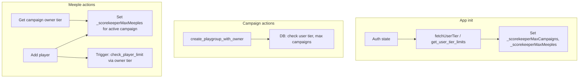

# Tiered Membership System (Schema + Limits + Fayres + Townhall)

Build each feature in order; test after each phase before moving on.

---

## Build Order (Sequential Phases)


| Phase | Feature                        | Depends On | Migration               |
| ----- | ------------------------------ | ---------- | ----------------------- |
| 1     | Tier foundation (limits)       | —          | 020                     |
| 2     | fetchUserTier + Admin set tier | Phase 1    | —                       |
| 3     | Import/Export gating           | Phase 2    | —                       |
| 4     | Premium profile (Knight+)      | Phase 2    | 020 (user_profile cols) |
| 5     | Privacy policy update          | —          | —                       |
| 6     | Fayres (semi-admin)            | Phase 2    | 021                     |
| 7     | Townhall (per-campaign wiki)   | Phase 6    | 022                     |
| 8     | Achievement tier placeholder   | Phase 2    | —                       |


---

## Issues & Discrepancies

1. **Current limits:** Code already uses 4 campaigns, 8 meeples ([018_enforce_limits.sql](supabase/migrations/018_enforce_limits.sql), [admin_tables.sql](sql/admin_tables.sql)). Phase 1 replaces hardcoded 4/8 with tier-based limits; Peasant stays 4/8; Knight/Noble/Royalty get higher limits.
2. **Schema split:** Migration 020 = tiers + user_profile extensions. Migration 021 = Fayres. Migration 022 = Townhall. Do not add Fayre/Townhall tables until those phases.
3. **fetchUserTier timing:** Needed by Import/Export, Premium Profile, Fayres/Townhall gates. Build in Phase 2 so later phases can rely on it.
4. **Admin "Set user tier":** Required for testing. Include in Phase 2 so tiers can be changed without Stripe.
5. **Newsletter / email_security_pin:** Schema in 020; UI in Premium Profile (Phase 4). Privacy copy (Phase 5) references them.
6. **Fayres before Townhall:** Fayre semi-admins moderate Townhall. Fayres must exist first.
7. **Open items:** Moderation workflow (Royalty edits via Fayre approval?) and exact admin tabs for Fayre semi-admins — resolve before Phase 6.

---

## Current State

- **Limits:** 4 campaigns per user, 8 meeples per campaign (hardcoded in [018_enforce_limits.sql](supabase/migrations/018_enforce_limits.sql) and [app_config](sql/admin_tables.sql))
- **Profile:** [user_profile](supabase/migrations/015_user_profile_favourite_game.sql) has `favourite_game` only (basic)
- **Import/Export:** Disabled in [events.js](js/events.js) ("Coming Soon")
- **Achievements:** Planned in [100_tiered_achievements plan](.cursor/plans/100_tiered_achievements_e33889b7.plan.md), not implemented
- **Fayres / Townhall:** Not in codebase; Royalty-only features

## Tier Matrix (Reference)


| Tier    | Campaigns | Meeples | Profile             | Achievements | Imp/Exp                  |
| ------- | --------- | ------- | ------------------- | ------------ | ------------------------ |
| Peasant | 4         | 8       | basic               | basic        | -                        |
| Knight  | 10        | 20      | socmed links/status | knight-tier  | yes                      |
| Noble   | 67        | 67      | same                | noble-tier   | same                     |
| Royalty | 999       | 999     | same                | royal-tier   | same + Fayres + Townhall |


---

---

## Phase 1: Tier Foundation (Limits)

**Goal:** Replace hardcoded campaign/meeple limits with tier-based limits. All users default to Peasant (4 campaigns, 8 meeples).

### 1.1 Build — Migration 020 (tiers + limit logic only)

**Tables and functions:**

```sql
-- user_tiers table
CREATE TABLE user_tiers (
    user_id UUID PRIMARY KEY REFERENCES auth.users(id) ON DELETE CASCADE,
    tier TEXT NOT NULL DEFAULT 'peasant' CHECK (tier IN ('peasant', 'knight', 'noble', 'royalty')),
    stripe_subscription_id TEXT,
    stripe_customer_id TEXT,
    royalty_purchased_at TIMESTAMPTZ,  -- for bonding curve slot
    updated_at TIMESTAMPTZ DEFAULT now()
);
```

- RLS: users can read own row; service role manages all
- Seed existing users with `tier = 'peasant'` (or rely on COALESCE in functions)
- Default `peasant` ensures all current users continue as free tier (no breaking change)

### 1.2 `user_profile` extensions

Add columns for Knight+ premium profile:

```sql
ALTER TABLE user_profile ADD COLUMN IF NOT EXISTS socmed_links JSONB DEFAULT '{}';
ALTER TABLE user_profile ADD COLUMN IF NOT EXISTS status TEXT;
ALTER TABLE user_profile ADD COLUMN IF NOT EXISTS email_security_pin CHAR(4);  -- 4-digit PIN for email verification (anti-phishing)
ALTER TABLE user_profile ADD COLUMN IF NOT EXISTS newsletter_opt_in BOOLEAN DEFAULT false;  -- opt-in for updates, promos; default off at signup
```

- `socmed_links`: e.g. `{ "twitter": "handle", "bgg": "username" }`
- `status`: optional short bio/status line
- `email_security_pin`: `CHAR(4)` — unique 4-digit PIN shown in app-sent emails for user verification (anti-phishing). Generate on first signup or first paid tier.
- `newsletter_opt_in`: `BOOLEAN DEFAULT false` — users are opt-out by default at signup/first login; must enable from profile page to receive newsletters (updates, promos).

### 1.3 Royalty bonding curve helper

```sql
CREATE OR REPLACE FUNCTION get_royalty_fee_bracket()
RETURNS TABLE (fee_cents INTEGER, bracket_label TEXT) AS $$
    SELECT 
        CASE 
            WHEN cnt <= 10 THEN 9900
            WHEN cnt <= 20 THEN 10900
            WHEN cnt <= 30 THEN 11900
            WHEN cnt <= 40 THEN 12900
            WHEN cnt <= 50 THEN 13900
            WHEN cnt <= 60 THEN 14900
            WHEN cnt <= 70 THEN 15900
            WHEN cnt <= 80 THEN 16900
            WHEN cnt <= 90 THEN 17900
            WHEN cnt <= 100 THEN 18900
            ELSE 19900
        END,
        CASE 
            WHEN cnt <= 10 THEN '1-10'
            WHEN cnt <= 20 THEN '11-20'
            -- ...
            ELSE '100+'
        END
    FROM (SELECT COUNT(*)::INT cnt FROM user_tiers WHERE tier = 'royalty') t;
$$ LANGUAGE sql STABLE SECURITY DEFINER;
```

- Create `get_tier_limits(tier)` returning max_campaigns, max_meeples (4/8, 10/20, 67/67, 999/999)
- Create RPC `get_user_tier_limits(p_user_id UUID)` returning tier, max_campaigns, max_meeples
- Replace `create_playgroup_with_owner` — use tier from `user_tiers` (COALESCE peasant) for campaign limit
- Replace `check_player_limit` trigger — use owner's tier (via playgroups.created_by) for meeple limit

**Frontend:** [main.js](js/main.js) `loadBetaLimits()` → call `get_user_tier_limits(auth.uid())` instead of `fetchAppConfig()`; set `window._scorekeeperMaxCampaigns`, `_scorekeeperMaxMeeples`. [playgroups.js](js/playgroups.js): on playgroup change, fetch owner tier and set `_scorekeeperMaxMeeples` for active campaign. [events.js](js/events.js): meeple add uses `_scorekeeperMaxMeeples`. Ensure `fetchPlaygroups` returns `created_by`.

### 1.3 Test (Phase 1)

- Log in; verify campaign count shows "X of 4" (Peasant)
- Create 4 campaigns; verify 5th is blocked
- Add 8 meeples to a campaign; verify 9th is blocked
- (After Phase 2) Set tier to knight in admin; verify limits become 10/20

---

## Phase 2: fetchUserTier + Admin Set Tier

**Goal:** Expose user tier to frontend; allow admins to set tier for testing.

### 2.1 Build

- [supabase.js](js/supabase.js): `fetchUserTier()` — read `user_tiers.tier` for `auth.uid()` (or RPC)
- [main.js](js/main.js): Call `fetchUserTier()` on init; set `window._scorekeeperUserTier`; refresh on login
- [admin.html](admin.html) / [admin-page.js](js/admin-page.js): Add "Set tier" dropdown to Users tab; service-role upsert to `user_tiers`

### 2.2 Test (Phase 2)

- Log in; verify `_scorekeeperUserTier` is `peasant`
- Admin sets user to knight; refresh app; verify tier updated
- Verify Phase 1 limits now respect tier (knight = 10 campaigns, 20 meeples)

---

## Phase 3: Import/Export Gating

**Goal:** Re-enable Import/Export; gate Import to Knight+.

**Depends on:** Phase 2 (fetchUserTier).

### 3.1 Build

- [events.js](js/events.js): Remove "Coming Soon"; wire export/import handlers
- Before import: if `_scorekeeperUserTier === 'peasant'`, show upgrade prompt
- Export: allow all tiers

### 3.2 Test (Phase 3)

- Peasant: Import shows "Import is available on Knight tier and above"
- Knight+: Import works
- Export works for all tiers

---

## Phase 4: Premium Profile (Knight+)

**Goal:** Add socmed links, status, newsletter opt-in; gate premium fields to Knight+.

**Depends on:** Phase 2. Schema (user_profile cols) in migration 020.

### 4.1 Build

- [supabase.js](js/supabase.js): Extend `fetchUserProfile`, `upsertUserProfile` for socmed_links, status, newsletter_opt_in, email_security_pin
- [modals.js](js/modals.js): Add premium fields (socmed, status); newsletter toggle; gate by tier
- RLS: Knight+ can write socmed/status; all users can write newsletter_opt_in

### 4.2 Test (Phase 4)

- Peasant: profile shows favourite game only; no socmed/status/newsletter
- Knight+: profile shows socmed, status, newsletter toggle
- Toggle newsletter; verify persisted

---

## Phase 5: Privacy Policy Update

**Goal:** Add email/billing and newsletter commitments; mention security PIN.

### 5.1 Build

- [privacy.html](privacy.html): Add section on email/billing (no unsolicited emails, no irregular payments, newsletter opt-in), security PIN mention

### 5.2 Test (Phase 5)

- Review privacy copy

---

## Phase 6: Fayres (Semi-Admin)

**Goal:** Fayres own campaigns; Royalty can be semi-admins with limited admin access.

**Depends on:** Phase 2. Build before Townhall (Phase 7).

### 6.1 Build — Migration 021

```sql
CREATE TABLE fayres (
    id UUID PRIMARY KEY DEFAULT gen_random_uuid(),
    name TEXT NOT NULL,
    created_by UUID REFERENCES auth.users(id),
    created_at TIMESTAMPTZ DEFAULT now()
);

CREATE TABLE fayre_campaigns (
    fayre_id UUID REFERENCES fayres(id) ON DELETE CASCADE,
    playgroup_id UUID REFERENCES playgroups(id) ON DELETE CASCADE,
    PRIMARY KEY (fayre_id, playgroup_id)
);

CREATE TABLE fayre_semi_admins (
    fayre_id UUID REFERENCES fayres(id) ON DELETE CASCADE,
    user_id UUID REFERENCES auth.users(id) ON DELETE CASCADE,
    PRIMARY KEY (fayre_id, user_id)
);
```

- RLS: Full admins manage fayres; Fayre semi-admins read their assigned fayres; users read fayres they are semi-admin of
- Only full admins can create Fayres and assign semi-admins
- Royalty users can be assigned as Fayre semi-admins

**Supabase + Admin:** [supabase.js](js/supabase.js): fayre CRUD, `getFayreIdsForUser`, `isFayreSemiAdmin`. [admin.html](admin.html) / [admin-page.js](js/admin-page.js): Fayres tab (create, assign campaigns, assign semi-admins); if Fayre semi-admin, show only Campaigns/Users/Invites filtered to their Fayre's campaigns. [index.html](index.html): Fayres nav (Royalty-gated).

### 6.2 Test (Phase 6)

- Admin creates Fayre, assigns campaigns, assigns Royalty user as semi-admin
- Fayre semi-admin logs in; enters admin; sees limited view (no Config, BGG, etc.)
- Fayre semi-admin can remove user from campaign within their Fayre

---

## Phase 7: Townhall (Per-Campaign Wiki)

**Goal:** Per-campaign wiki; Royalty can edit; Fayre semi-admins moderate.

**Depends on:** Phase 6 (Fayres).

### 7.1 Build — Migration 022

```sql
CREATE TABLE townhall_pages (
    id UUID PRIMARY KEY DEFAULT gen_random_uuid(),
    playgroup_id UUID NOT NULL REFERENCES playgroups(id) ON DELETE CASCADE,
    slug TEXT NOT NULL,
    title TEXT NOT NULL,
    body TEXT,
    visibility TEXT NOT NULL DEFAULT 'members_only' CHECK (visibility IN ('public', 'logged_in', 'members_only')),
    created_by UUID REFERENCES auth.users(id),
    updated_at TIMESTAMPTZ DEFAULT now(),
    UNIQUE(playgroup_id, slug)
);

CREATE INDEX idx_townhall_playgroup ON townhall_pages(playgroup_id);
```

- RLS: Read per visibility; Royalty can insert/update/delete for campaigns they own or are member of; Fayre semi-admins can moderate

**Supabase + UI:** [supabase.js](js/supabase.js): townhall CRUD. [index.html](index.html) + Townhall section: list pages, view/edit (Royalty); visibility selector; link from campaign context.

### 7.2 Test (Phase 7)

- Royalty creates wiki page for campaign they own
- Royalty edits page; sets visibility
- Read visibility: members_only vs logged_in vs public
- Fayre semi-admin can moderate Townhall of their Fayre's campaigns

---

## Phase 8: Achievement Tier Placeholder

**Goal:** Expose `_scorekeeperAchievementTier` for future achievements UI.

**Depends on:** Phase 2.

### 8.1 Build

- [main.js](js/main.js): Set `window._scorekeeperAchievementTier` from tier (`peasant`→basic, `knight`→knight, etc.)
- No new UI

### 8.2 Test (Phase 8)

- Verify `_scorekeeperAchievementTier` is set on load

---

## Reference: Townhall UI Details

- Add "Townhall" nav item in [index.html](index.html), gated: `userTier === 'royalty'` to edit; read gated by visibility

---

## Reference: Admin Notes

- Admin creates playgroups via service role (direct insert or separate RPC); RPC `create_playgroup_with_owner` is for normal users. Admin's `user_tiers` can be set to royalty for testing.
- Keep `app_config`; `loadBetaLimits` prefers tier-based limits. Optional: deprecate global beta limits in admin Config tab.

---

## Data Flow Diagram




---

## Non-Breaking Checklist

- Default tier `peasant` for all users
- No auth flow changes
- RPCs remain callable; new ones additive
- Profile: new columns nullable; existing favourite_game unchanged
- Import/Export: re-enabled only for Knight+; Peasant sees upgrade prompt

---

---

## Files by Phase


| Phase | Files                                                                               |
| ----- | ----------------------------------------------------------------------------------- |
| 1     | `020_tiered_membership.sql`, `main.js`, `playgroups.js`, `events.js`, `supabase.js` |
| 2     | `supabase.js`, `main.js`, `admin.html`, `admin-page.js`                             |
| 3     | `events.js`                                                                         |
| 4     | `supabase.js`, `modals.js`                                                          |
| 5     | `privacy.html`                                                                      |
| 6     | `021_fayres.sql`, `supabase.js`, `admin.html`, `admin-page.js`, `index.html`        |
| 7     | `022_townhall.sql`, `supabase.js`, `index.html` (Townhall section)                  |
| 8     | `main.js`                                                                           |


**Note:** Migration 020 includes user_tiers, user_profile cols, get_tier_limits, get_user_tier_limits, get_royalty_fee_bracket, replaced create_playgroup/check_player_limit. Excludes fayres/townhall (021/022).

---

## 14. Billing Emails, Reminders, and Admin Billing (Follow-up Phase)

The app is **not currently geared** for billing emails or subscription management. No transactional email service or scheduled jobs exist. Admin has no billing view.

### 14.1 Stripe Built-in Billing Emails

Stripe handles many needs out of the box (no custom code):


| Feature                       | How                                                                                  | Notes                                     |
| ----------------------------- | ------------------------------------------------------------------------------------ | ----------------------------------------- |
| **Upcoming renewal reminder** | Stripe Dashboard → Billing → Customer emails → "Send emails about upcoming renewals" | Min 3 days before bill date; configurable |
| **Auto-renew**                | Default for subscriptions                                                            | Users can cancel via Customer Portal      |
| **Payment receipts**          | Automatic on successful charge                                                       |                                           |
| **Failed payment retry**      | Stripe retries; sends dunning emails                                                 | Configurable in Dashboard                 |
| **Manage subscription**       | Stripe Customer Portal                                                               | Link users to hosted billing page         |


**Recommendation:** Enable Stripe's "Send emails about upcoming renewals" (3 days before billing) and use Stripe Customer Portal for manage subscription / cancel / update payment. Covers most needs.

### 14.2 Custom Reminders (Optional)

If you need reminders at different intervals (e.g. 7 days + 3 days) or branded emails:

- Add Supabase Edge Function + Resend/SendGrid (or similar)
- Trigger via `pg_cron` or external cron (e.g. Vercel Cron, GitHub Actions) on schedule
- Query `user_tiers` + Stripe API for subscriptions with `current_period_end` in 7 days / 3 days
- Send custom HTML emails

### 14.3 Admin Page Updates Required


| Update                              | Purpose                                                                                        |
| ----------------------------------- | ---------------------------------------------------------------------------------------------- |
| **New "Billing" tab**               | View paid users, subscription status, next bill date                                           |
| **Paid users table**                | Columns: Email, Name, Tier, Status (active / past_due / canceled), Next bill date, Stripe link |
| **Royalty curve status**            | Show current Royalty count (1–10, 11–20, …), current price, fee bracket                        |
| **Set user tier** (already in plan) | Manual override for support                                                                    |
| **Config tab evolution**            | Deprecate global beta limits; optionally add tier-default overrides                            |


**Schema addition for Stripe phase:** Store `subscription_period_end` (or equivalent) in `user_tiers` / Stripe webhook payload so admin can show "Next bill: …" without calling Stripe on every load.

### 14.4 User-Facing Billing (Deferred)

Users need a way to manage subscription, payment method, and preferences:

- Add **Account / Billing** section in app (or separate page)
- "Manage subscription" → Stripe Customer Portal
- Optional: per-user preferences (reminder days, marketing opt-in) stored in `user_profile` or `user_tiers` if you add custom reminder logic

### 14.5 Privacy Policy Update (Email and Payments Commitment)

Update [privacy.html](privacy.html) to add explicit commitments:

- **No unsolicited emails:** We will never send unsolicited marketing or promotional emails. Newsletter (updates, promos) is **opt-in only** — users are opt-out by default at signup/first login and must enable it from their profile page.
- **Newsletter:** We may send newsletters (product updates, promos) to users who have opted in. You can opt in or opt out at any time from your profile page.
- **No irregular payment requests:** We will never ask for irregular payments or request payment outside the normal billing flow. The only payment-related emails are:
  - Upcoming renewal reminders (e.g. 3 days before your bill date)
  - Receipts and failed-payment retry notices (handled by Stripe)

Add a new section (e.g. "Email and Billing Communications") under "How We Use Your Information" or as a dedicated subsection.

### 14.6 Newsletter Opt-In (Profile Page)


| Aspect              | Implementation                                                                                      |
| ------------------- | --------------------------------------------------------------------------------------------------- |
| **Default**         | `newsletter_opt_in = false` at signup / first login                                                 |
| **Opt-in location** | Profile page: toggle "Receive product updates and promos"                                           |
| **Scope**           | Newsletters (updates, promos) sent only to users where `newsletter_opt_in = true`                   |
| **Unsubscribe**     | User can toggle off in profile at any time; include unsubscribe link in newsletter footer as backup |


**Files:** migration (add `newsletter_opt_in`), [modals.js](js/modals.js) / profile UI (toggle), [supabase.js](js/supabase.js) (upsertUserProfile).

### 14.7 Email Security PIN (4-Digit Verification)

Each user has a unique 4-digit security PIN shown in every app-sent email. Users can verify that an email is genuinely from The Scorekeeper by checking for their PIN (helps distinguish from phishing).


| Aspect              | Implementation                                                                                                                                                          |
| ------------------- | ----------------------------------------------------------------------------------------------------------------------------------------------------------------------- |
| **Schema**          | Add `email_security_pin CHAR(4)` to `user_profile`. Generate on first signup or first paid-tier upgrade.                                                                |
| **Generation**      | Random 4-digit string (0000–9999), ensure uniqueness or accept low collision risk.                                                                                      |
| **Display**         | Include in email body: "Your security PIN for this email: XXXX" (prominent but not as subject).                                                                         |
| **User visibility** | User can view their PIN in Account/Settings. Option to regenerate.                                                                                                      |
| **Scope**           | Applies to **our** transactional emails and newsletters (custom renewal reminders, security notices, product updates). Stripe’s built-in emails do not include our PIN. |


**Files:** [privacy.html](privacy.html) (commitment), migration (add `email_security_pin`), Account/Settings UI (view/regenerate), email templates.

---

## 15. Deferred (Follow-up Phases)

- Stripe integration: Checkout for Knight/Noble subscriptions, Royalty one-time with bonding curve
- Webhooks: sync Stripe subscription status to `user_tiers` (including `subscription_period_end`, status)
- Stripe Dashboard: enable renewal reminder emails (3 days before billing)
- User-facing "Manage subscription" / Stripe Customer Portal link
- Admin Billing tab (paid users, Royalty curve, next bill dates)
- Optional: custom reminder emails via Edge Function + Resend/SendGrid + cron
- Achievement tables and evaluation logic (per 100_tiered_achievements plan)

---

## Appendix A: Fayres & Townhall — Reference Spec

Design decisions captured from requirements gathering. Used in Sections 7 and 8.

### Fayres (Semi-Admin)


| Aspect                          | Decision                                                                                                                                                                                                                                                                                       |
| ------------------------------- | ---------------------------------------------------------------------------------------------------------------------------------------------------------------------------------------------------------------------------------------------------------------------------------------------- |
| **Definition**                  | Fayres have admin-level powers but **not** full app admin. They can access the admin page with limited areas and powers. Main purpose: moderation — controlling users within campaigns they own (or campaigns their Fayre owns). They do not get full admin (global config, delete-all, etc.). |
| **Scope**                       | Per-Fayre — users are semi-admin of specific Fayre(s) they are assigned to; powers apply to campaigns they own or campaigns their Fayre owns                                                                                                                                                   |
| **Admin page access**           | Yes, but limited — restricted sections (e.g. Campaigns they moderate, Users within those campaigns). No access to Config, global Billing, BGG Linking, or other full-admin areas                                                                                                               |
| **Moderation powers**           | Control users within campaigns (e.g. remove users, manage invites). Main use: moderate the campaigns they own                                                                                                                                                                                  |
| **Campaign link**               | A Fayre **owns** one or more campaigns. Fayre semi-admins moderate those campaigns (users, Townhall)                                                                                                                                                                                           |
| **Who creates Fayres**          | Full admins only                                                                                                                                                                                                                                                                               |
| **Who can be Fayre semi-admin** | Royalty tier (access grant); assigned by admin                                                                                                                                                                                                                                                 |
| **Fayre–Townhall link**         | Yes — Fayre semi-admins moderate/curate Townhall of campaigns owned by their Fayre                                                                                                                                                                                                             |


**Schema:** See Section 7.1. Admin page: route-based or role-based UI to show only permitted sections for Fayre users.

### Townhall (Wiki Pages)


| Aspect           | Decision                                                                                             |
| ---------------- | ---------------------------------------------------------------------------------------------------- |
| **Scope**        | Per-campaign — each campaign has its own wiki pages                                                  |
| **Content**      | Freeform — any topic users want to document                                                          |
| **Who can edit** | Royalty tier only — and only wikis of campaigns they **own or are a member of**                      |
| **Who can read** | Configurable per campaign or per page (public / logged-in / members-only)                            |
| **Moderation**   | Fayre semi-admins moderate Townhall of campaigns owned by their Fayre (approve/reject edits, curate) |


**Schema:** See Section 8.1. Visibility: `public` | `logged_in` | `members_only`. Add `townhall_edit_queue` if moderation workflow (Royalty edits require Fayre approval) is chosen.

### Permissions Summary


| Role                     | Admin page                             | Fayres                            | Campaign moderation | Townhall (edit)                                   | Townhall (moderate)   |
| ------------------------ | -------------------------------------- | --------------------------------- | ------------------- | ------------------------------------------------- | --------------------- |
| Full admin               | Full                                   | Create Fayres, assign semi-admins | All campaigns       | Full access                                       | Full access           |
| Fayre semi-admin         | Moderate Townhall of Fayre’s campaigns | Moderate only (approve/reject)    | Per visibility      |                                                   |                       |
| Royalty                  | —                                      | Access if assigned                | —                   | Edit wikis of campaigns they own or are member of | —                     |
| Knight / Noble / Peasant | —                                      | —                                 | —                   | —                                                 | Per visibility (read) |


### Non-Breaking Requirements

- Existing `playgroups` (campaigns) must continue to work without a Fayre; Fayre link is optional
- Campaigns can exist without Townhall pages; empty wiki by default
- No change to existing RLS for playgroups, games, players, entries
- New tables and routes; gate UI by tier (`canAccessFayres`, `canAccessTownhall`)

### Open Items (User to Provide)

1. **Moderation workflow** — Do Royalty Townhall edits require Fayre semi-admin approval, or do Royalty and Fayre semi-admins both edit directly (Fayre = extra curate/approve powers)?
2. **Admin sections for Fayre** — Exact list of which admin tabs/sections Fayre semi-admins can see (e.g. Campaigns filter, Users filter, Invites for their campaigns; exclude Config, Announcements, BGG Linking, etc.).

